# 📊 FitAI Navigation Diagram (Mermaid)

## Complete Navigation Architecture

## Onboarding Flow (Sequential)

## Screen Count by Category

**Total Planned:** 92 screens  
**Currently Implemented:** 83 screens (90%)  
**Missing:** 9 screens (10%)

### Implementation Progress

| Category | Planned | Implemented | Missing | % Complete |
|----------|---------|-------------|---------|------------|
| **Home** | 4 | 4 | 0 | 100% ✅ |
| **Workout** | 18 | 18 | 0 | 100% ✅ |
| **Social** | 12 | 11 | 1 | 92% ⚠️ |
| **Explore** | 6 | 5 | 1 | 83% ⚠️ |
| **Profile** | 33 | 26 | 7 | 79% ⚠️ |
| **Auth** | 8 | 8 files (2 in nav) | 6 not registered | 25% ❌ |
| **Onboarding** | 11 | 11 files | No navigator | 0% ❌ |
| **TOTAL** | **92** | **83** | **9** | **90%** |

## Tab Navigator Structure

```mermaid
graph TB
    MainTabs["Main Tab Navigator<br/>(Bottom Tabs)"]
    
    MainTabs -->|Tab 1| Home["🏠 Home<br/>4/4 screens ✅"]
    MainTabs -->|Tab 2| Workout["💪 Workout<br/>18/18 screens ✅"]
    MainTabs -->|Tab 3| Explore["🧭 Explore<br/>5/6 screens ⚠️"]
    MainTabs -->|Tab 4| Social["👥 Social<br/>11/12 screens ⚠️"]
    MainTabs -->|Tab 5| Profile["👤 Profile<br/>26/33 screens ⚠️"]
    
    classDef tabClass fill:#228be6,stroke:#1971c2,color:#fff
    class MainTabs tabClass
```

## Workout Navigator Deep Dive

## Profile Navigator Deep Dive

## Navigation File Structure

```mermaid
graph LR
    Root[src/navigation/]
    
    Root --> Types[types.ts<br/>Type Definitions]
    Root --> RootNav[RootNavigator.tsx<br/>Root Logic]
    Root --> AuthNav[AuthStack.tsx<br/>8 screens]
    Root --> MainNav[MainTabs.tsx<br/>Bottom Tabs + Home]
    Root --> WorkoutNav[WorkoutNavigator.tsx<br/>18 screens]
    Root --> ExploreNav[ExploreNavigator.tsx<br/>5 screens]
    Root --> SocialNav[SocialNavigator.tsx<br/>11 screens]
    Root --> ProfileNav[ProfileNavigator.tsx<br/>26/33 screens ⚠️]
    Root --> OnboardingNav[❌ OnboardingStack.tsx<br/>0/11 - MISSING]
    
    classDef typeFile fill:#228be6,stroke:#1971c2,color:#fff
    classDef navFile fill:#51CF66,stroke:#2F9E44,color:#fff
    classDef missingFile fill:#FA5252,stroke:#C92A2A,color:#fff
    
    class Types typeFile
    class RootNav,AuthNav,MainNav,WorkoutNav,ExploreNav,SocialNav,ProfileNav navFile
    class OnboardingNav missingFile
```

## Screen Implementation Status (92 Planned)

```mermaid
graph TD
    Total["Total Planned: 92 Screens<br/>Implemented: 83 (90%)"]
    
    Total --> Fully[Fully Implemented<br/>64 screens]
    Total --> Files[Files Exist<br/>Not Registered: 19]
    Total --> Missing[Missing Files<br/>9 screens]
    
    Fully --> HomeImpl[Home: 4/4 ✅]
    Fully --> WorkoutImpl[Workout: 18/18 ✅]
    
    Files --> AuthFiles[Auth: 6 screens<br/>Files exist, not in nav]
    Files --> OnboardingFiles[Onboarding: 11 screens<br/>No navigator]
    Files --> ProfilePartial[Profile: 2 screens<br/>Files exist, not registered]
    
    Missing --> ProfileMissing[Profile: 7 screens ❌<br/>EditProfile, Achievements, etc.]
    Missing --> SocialMissing[Social: 1 screen ❌<br/>ShareWorkout]
    Missing --> ExploreMissing[Explore: 1 screen ❌<br/>MyCustomExercises]
    
    classDef successClass fill:#51CF66,stroke:#2F9E44,color:#fff
    classDef warningClass fill:#FAB005,stroke:#F59F00,color:#000
    classDef errorClass fill:#FA5252,stroke:#C92A2A,color:#fff
    
    class HomeImpl,WorkoutImpl,Fully successClass
    class AuthFiles,OnboardingFiles,ProfilePartial,Files warningClass
    class ProfileMissing,SocialMissing,ExploreMissing,Missing errorClass
```

---

**To view these diagrams:**
1. Copy the mermaid code blocks
2. Paste into [Mermaid Live Editor](https://mermaid.live/)
3. Or use a Mermaid-compatible Markdown viewer

**Alternatively:**
- GitHub natively renders Mermaid diagrams in markdown files
- VS Code with Mermaid extensions can preview these diagrams

---

## 🎯 Path to 92 Screens

### Current Status
- **Implemented & Working:** 64 screens (70%)
- **Files Exist, Not Registered:** 19 screens (21%)
- **Need to Create:** 9 screens (9%)

### Quick Wins (30 min → 89 screens)
1. Register 6 auth screens in `AuthStack.tsx`
2. Create `OnboardingStack.tsx` navigator (11 screens already exist)
3. **Result:** 83 → 89 screens (+6)

### Essential Screens (6-8 hours → 92 screens) 
1. `EditProfileScreen.tsx`
2. `AchievementsScreen.tsx`
3. `XPHistoryScreen.tsx`
4. **Result:** 89 → **92 screens (+3)** ✅

### Full Completion (2-3 weeks → 98 screens)
Implement remaining 6 screens for 100% feature parity.

---

**See `SCREENS_AND_NAVIGATION.md` for complete documentation**  
**See `MISSING_SCREENS_ANALYSIS.md` for detailed missing screen breakdown**
