# 🏗️ FitAI Frontend - High-Level Design (HLD)

**Last Updated:** February 6, 2026  
**Document Version:** 1.0  
**Application:** FitAI - AI-Powered Fitness Tracking Mobile App  
**Platform:** React Native (iOS & Android)

---

## Table of Contents

1. [System Overview](#1-system-overview)
2. [Technology Stack](#2-technology-stack)
3. [Architecture Layers](#3-architecture-layers)
4. [State Management Strategy](#4-state-management-strategy)
5. [Navigation Architecture](#5-navigation-architecture)
6. [Backend Integration](#6-backend-integration)
7. [Authentication & Authorization](#7-authentication--authorization)
8. [Error Handling Strategy](#8-error-handling-strategy)
9. [Performance Optimization](#9-performance-optimization)
10. [Offline & Caching Strategy](#10-offline--caching-strategy)

---

## 1. System Overview

### 1.1 System Context

```mermaid
graph TB
    User[👤 Mobile User<br/>iOS & Android]
    App[📱 FitAI Mobile App<br/>React Native]
    Backend[⚙️ Backend API<br/>Node.js + Express]
    DB[(🗄️ PostgreSQL<br/>Prisma ORM)]
    Firebase[🔔 Firebase<br/>Push Notifications]
    AI[🤖 Gemini AI<br/>Workout Generation]
    
    User -->|Interacts| App
    App <-->|REST API| Backend
    Backend <--> DB
    Backend --> Firebase
    Backend --> AI
    Firebase -.->|Push| App
```



### 1.2 Application Scope

**FitAI** is a comprehensive fitness tracking mobile application with:
- **92 screens** planned (83 implemented, 9 missing)
- **7 major feature domains**: Auth, Onboarding, Home, Workout, Explore, Social, Profile
- **AI-powered features**: Workout generation, form analysis, coaching
- **Social features**: Posts, challenges, leaderboards
- **Analytics**: Stats, PRs, muscle distribution, progression tracking

### 1.3 Design Principles

| Principle | Implementation |
|-----------|----------------|
| **Mobile-First** | Touch targets ≥44px, thumb-zone CTAs, gesture-aware navigation |
| **Offline-Capable** | Zustand persistence, optimistic updates, workout session recovery |
| **Type-Safe** | TypeScript throughout, strict null checks, navigation param types |
| **Performance-Optimized** | FlatList memoization, React Query caching, native animations |
| **Platform-Respectful** | iOS edge swipe + Android back button, platform-specific icons |

---

## 2. Technology Stack

### 2.1 Core Technologies

| Category | Technology | Version | Purpose |
|----------|-----------|---------|---------|
| **Framework** | React Native | 0.76.x | Cross-platform mobile development |
| **Runtime** | Expo | ~52.x | Development workflow, OTA updates |
| **Language** | TypeScript | 5.x | Type safety, developer experience |
| **Navigation** | React Navigation | 6.x | Stack & Tab navigation |
| **State (Session)** | Zustand | 5.x | Client-side session state |
| **State (Server)** | React Query | 5.x | Server state, caching, mutations |
| **HTTP Client** | Axios | 1.x | API requests, interceptors |
| **Storage** | AsyncStorage | 1.x | Local persistence |
| **Styling** | StyleSheet API | - | React Native styling |

### 2.2 Development Tools

- **Package Manager**: npm
- **Linter**: ESLint
- **Formatter**: Prettier
- **Type Checking**: tsc (TypeScript compiler)

---

## 3. Architecture Layers

### 3.1 Layer Diagram


### 3.2 Layer Responsibilities

#### **Presentation Layer** (`src/screens/`, `src/components/`, `src/navigation/`)
- **Screens**: Feature-specific UI, layout, user interactions
- **Components**: Reusable UI elements (buttons, cards, inputs)
- **Navigation**: Screen routing, deep linking, tab structure
- **Theme**: Design tokens (colors, spacing, typography)

**Rules:**
- ✅ **DO**: Use hooks to access state, call mutations, navigate
- ❌ **DON'T**: Contain business logic, make direct API calls, manage complex state

#### **Business Logic Layer** (`src/store/`, `src/hooks/`)
- **Zustand Stores**: Session state (auth, active workout, UI flags)
- **React Query Hooks**: CRUD operations, server data caching
- **Custom Hooks**: Reusable logic (timers, keyboard awareness, form validation)

**Rules:**
- ✅ **DO**: Encapsulate state mutations, coordinate API calls, validate data
- ❌ **DON'T**: Render UI directly, contain JSX

#### **Data Layer** (`src/api/`, `src/utils/storage.ts`)
- **API Clients**: HTTP methods for each domain (auth, workout, social, etc.)
- **Interceptors**: Token injection, refresh logic, error standardization
- **Storage**: Type-safe wrapper around AsyncStorage

**Rules:**
- ✅ **DO**: Handle HTTP concerns, serialize/deserialize data, manage tokens
- ❌ **DON'T**: Contain business logic, UI concerns

---

## 4. State Management Strategy

### 4.1 Hybrid Approach: Zustand + React Query

FitAI uses a **dual state management approach** to separate concerns:


### 4.2 Decision Matrix: When to Use What?

| State Type | Use Zustand | Use React Query | Example |
|------------|-------------|-----------------|---------|
| **Authentication state** | ✅ | ❌ | `user`, `accessToken`, `isAuthenticated` |
| **Active workout session** | ✅ | ❌ | `activeWorkoutId`, `exercises`, `sets`, `elapsedSeconds` |
| **UI state** | ✅ | ❌ | `minimized`, `activeTab`, `isMenuOpen` |
| **Server data (read)** | ❌ | ✅ | Workout history, routines, exercises |
| **Server mutations** | ❌ | ✅ | Create workout, update profile, post comment |
| **Cached API responses** | ❌ | ✅ | Stats, leaderboard, social feed |

**Rationale:**
- **Zustand**: Fast, synchronous access for session/workflow state that needs persistence
- **React Query**: Automatic caching, background refresh, optimistic updates for server data

### 4.3 Zustand Store Architecture

#### **authStore** (`src/store/authStore.ts`)

```typescript
interface AuthState {
  // State
  user: User | null;
  accessToken: string | null;
  refreshToken: string | null;
  isAuthenticated: boolean;
  isLoading: boolean;
  
  // Actions
  login: (tokens, user) => Promise<void>;
  logout: () => Promise<void>;
  updateUser: (userData: Partial<User>) => void;
  hydrate: () => Promise<void>;
}
```

**Persistence:** None (tokens stored via `storage` utility)  
**Usage:** `const user = authStore((state) => state.user);`

#### **workoutStore** (`src/store/workoutStore.ts`)

```typescript
interface WorkoutState {
  // Session
  activeWorkoutId: number | null;
  workoutName: string | null;
  startTime: string | null;
  status: 'idle' | 'in_progress' | 'paused';
  
  // Normalized Data
  exercises: Record<number, WorkoutExercise>;
  sets: Record<string, WorkoutSet>; // Supports temp IDs
  
  // UI
  elapsedSeconds: number;
  minimized: boolean;
  
  // Actions
  startWorkout: (input) => Promise<void>;
  logSet: (exerciseId, input) => Promise<void>; // Optimistic
  completeWorkout: (input) => Promise<void>;
}
```

**Persistence:** ✅ `workout-storage` → AsyncStorage (session recovery)  
**Pattern:** Optimistic updates with rollback on failure

### 4.4 React Query Hook Architecture

**11 Query Hook Files:**
1. `useAuthQueries` - Login, register, verify, logout mutations
2. `useWorkoutQueries` - CRUD for workouts
3. `useRoutineQueries` - CRUD for routines
4. `useExerciseQueries` - Exercise library, filters
5. `useStatsQueries` - PRs, progression, volume
6. `useSocialQueries` - Follow, posts, comments
7. `useFeedQueries` - Social feed
8. `useUserQueries` - User profile, onboarding
9. `useBodyQueries` - Weight, measurements, photos
10. `useLeaderboardQueries` - Ranking, challenges
11. `useAIQueries` - Workout generation

**Query Key Strategy:**
```typescript
['workouts'] → List all workouts
['workouts', { page: 1, status: 'completed' }] → Filtered list
['workout', 123] → Single workout by ID
['routines'] → User's routines
['exercises', { muscleGroup: 'chest' }] → Filtered exercises
```

**Configuration:**
```typescript
const queryClient = new QueryClient({
  defaultOptions: {
    queries: {
      staleTime: 5 * 60 * 1000, // 5 minutes
      cacheTime: 10 * 60 * 1000, // 10 minutes
      retry: 2,
      refetchOnWindowFocus: false,
    },
  },
});
```

---

## 5. Navigation Architecture

### 5.1 Navigator Hierarchy

### 5.1 Navigator Hierarchy

**New Architecture: 5 Tabs + Drawer**


### 5.2 Screen Count Summary

| Navigator | Screens | Status | Description |
|-----------|---------|--------|-------------|
| **AuthStack** | 8 | ✅ | Login, Register, Verify |
| **Onboarding**| 10 | ✅ | User setup flow |
| **MainDrawer**| 5 | ✅ | Root authenticated container |
| **Home** | 4 | ✅ | Dashboard, Notifications |
| **Workout** | 24 | ✅ | Hub, Active, History, AI |
| **Explore** | 6 | 🚧 | Library, Custom Exercises |
| **Social** | 12 | ✅ | Feed, Posts, Challenges |
| **Profile** | 6 | ✅ | Hub, Edit, Activity |
| **Analytics** | 9 | ✅ | Stats Hub, PRs, Charts |
| **Coach** | 4 | ✅ | AI Chat, Form Analysis |
| **BodyTracking**| 5 | ✅ | Weight, Photos, Measure |
| **Settings** | 8 | ✅ | Account, App Settings |
| **TOTAL** | **101** | **95%**| Full Coverage |

### 5.3 Navigation Patterns

**Stack Navigation** (All navigators):
```typescript
navigation.navigate('ScreenName', { param: value });
navigation.goBack();
navigation.replace('ScreenName');
```

**Tab Navigation** (MainTabs):
```typescript
navigation.navigate('WorkoutTab', { screen: 'ActiveWorkout' });
```

**Deep Linking** (Planned):
```
fitai://workout/123
fitai://social/post/456
fitai://profile/stats
```

### 5.4 Type-Safe Navigation

All navigation uses TypeScript `ParamList` definitions:

```typescript
// src/navigation/types.ts
export type WorkoutStackParamList = {
  WorkoutHub: undefined;
  ActiveWorkout: { routineId?: number; workoutId?: number };
  WorkoutDetail: { workoutId: number };
  // ... 15 more screens
};

// Screen usage
type Props = StackScreenProps<WorkoutStackParamList, 'ActiveWorkout'>;

function ActiveWorkoutScreen({ route, navigation }: Props) {
  const { routineId, workoutId } = route.params; // Type-safe!
  // ...
}
```

---

## 6. Backend Integration

### 6.1 API Client Architecture


### 6.2 API Client Structure

**14 API Client Files:**

| File | Domain | Example Endpoints |
|------|--------|-------------------|
| `auth.api.ts` | Authentication | `/auth/login`, `/auth/register`, `/auth/verify` |
| `user.api.ts` | User Profile | `/user/profile`, `/user/onboarding` |
| `workout.api.ts` | Workouts | `/workouts`, `/workouts/:id/exercises` |
| `routine.api.ts` | Routines | `/routines`, `/routines/:id/exercises` |
| `exercise.api.ts` | Exercises | `/exercises`, `/exercises/:id` |
| `stats.api.ts` | Statistics | `/stats/prs`, `/stats/volume` |
| `social.api.ts` | Social | `/social/follow`, `/social/unfollow` |
| `feed.api.ts` | Feed | `/feed`, `/feed/posts/:id/like` |
| `leaderboard.api.ts` | Leaderboard | `/leaderboard`, `/challenges` |
| `body.api.ts` | Body Tracking | `/body/weight`, `/body/measurements` |
| `ai.api.ts` | AI Features | `/ai/generate-workout`, `/ai/analyze-form` |
| `gamification.api.ts` | Gamification | `/gamification/achievements` |
| `notifications.api.ts` | Notifications | `/notifications`, `/notifications/:id/read` |
| `client.ts` | Base Config | Axios instance, interceptors |

### 6.3 Request/Response Flow

**Standard Request:**
```typescript
// 1. Screen calls hook
const { mutate } = useCreateWorkout();
mutate({ name: 'Push Day', routineId: 5 });

// 2. Hook calls API client
workoutApi.createWorkout(input)

// 3. API client uses axios
POST /workouts
Headers: { Authorization: 'Bearer token' }
Body: { name: 'Push Day', routineId: 5 }

// 4. Backend responds
{ success: true, data: { id: 123, name: 'Push Day', ... } }

// 5. React Query caches & triggers onSuccess
```

### 6.4 Base URL Configuration

```typescript
// src/api/client.ts
const DEV_MACHINE_IP = '192.168.1.6'; // Local network IP
const API_BASE_URL = __DEV__ 
  ? `http://${DEV_MACHINE_IP}:3000/api/v1`
  : 'https://production-api.com/api/v1';

const apiClient = axios.create({
  baseURL: API_BASE_URL,
  timeout: 30000,
  headers: { 'Content-Type': 'application/json' },
});
```

---

## 7. Authentication & Authorization

### 7.1 Authentication Flow


### 7.2 Token Management

**Storage:**
```typescript
// src/utils/storage.ts
export const storage = {
  saveAccessToken: (token: string) => AsyncStorage.setItem('@fitness_access_token', token),
  getAccessToken: () => AsyncStorage.getItem('@fitness_access_token'),
  saveRefreshToken: (token: string) => AsyncStorage.setItem('@fitness_refresh_token', token),
  getRefreshToken: () => AsyncStorage.getItem('@fitness_refresh_token'),
  clearAuth: async () => {
    await AsyncStorage.multiRemove([
      '@fitness_access_token',
      '@fitness_refresh_token',
      '@fitness_user',
    ]);
  },
};
```

**Token Injection:**
```typescript
// Request interceptor
apiClient.interceptors.request.use(async (config) => {
  const token = authStore.getState().accessToken;
  if (token) {
    config.headers.Authorization = `Bearer ${token}`;
  }
  return config;
});
```

### 7.3 Token Refresh Flow

```mermaid
sequenceDiagram
    participant Screen
    participant API as apiClient
    participant Interceptor as Response Interceptor
    participant Backend
    participant Store as authStore
    
    Screen->>API: GET /workouts
    API->>Backend: Authorization: Bearer expired_token
    Backend-->>API: 401 Unauthorized
    API->>Interceptor: Error response
    Interceptor->>Store: getState().refreshToken
    Interceptor->>Backend: POST /auth/refresh { refreshToken }
    Backend-->>Interceptor: { accessToken, refreshToken }
    Interceptor->>Store: updateTokens(new tokens)
    Store-->>Interceptor: Tokens updated
    Interceptor->>Backend: Retry GET /workouts with new token
    Backend-->>Interceptor: 200 OK { data }
    Interceptor-->>Screen: Success response
    
    Note over Interceptor: If refresh fails → logout()
```



**Implementation:**
```typescript
apiClient.interceptors.response.use(
  (response) => response,
  async (error) => {
    const originalRequest = error.config;
    
    // Detect 401 and retry once
    if (error.response?.status === 401 && !originalRequest._retry) {
      originalRequest._retry = true;
      
      const refreshToken = authStore.getState().refreshToken;
      const response = await axios.post('/auth/refresh', { refreshToken });
      
      const { accessToken, refreshToken: newRefresh } = response.data.data;
      await authStore.getState().updateTokens(accessToken, newRefresh);
      
      originalRequest.headers.Authorization = `Bearer ${accessToken}`;
      return apiClient(originalRequest); // Retry
    }
    
    // Refresh failed → logout
    if (error.response?.status === 401) {
      authStore.getState().logout();
    }
    
    return Promise.reject(error);
  }
);
```

---

## 8. Error Handling Strategy

### 8.1 Error Types

| Error Type | HTTP Status | Handling |
|------------|-------------|----------|
| **Network Error** | - | Show "Check your connection" toast, enable retry |
| **Validation Error** | 400, 422 | Display field-specific errors |
| **Unauthorized** | 401 | Attempt token refresh → logout if fails |
| **Forbidden** | 403 | Show "You don't have permission" message |
| **Not Found** | 404 | Show "Resource not found" |
| **Server Error** | 500 | Show generic error, log to monitoring |

### 8.2 Standardized Error Format

```typescript
// src/api/client.ts
export interface ApiError {
  message: string;
  code?: string;
  status?: number;
  data?: any;
}

// Response interceptor standardizes errors
const standardError: ApiError = {
  message: errorData?.message || 'An unexpected error occurred',
  status: error.response?.status,
  code: errorData?.code,
  data: errorData?.data,
};
```

### 8.3 Error Handling Patterns

**In Screens:**
```typescript
const { mutate, isLoading, error } = useCreateWorkout();

// Display error
{error && <ErrorBanner message={error.message} />}

// Retry
<Button onPress={() => mutate(data)}>Retry</Button>
```

**In Zustand Stores:**
```typescript
try {
  const response = await workoutApi.startWorkout(input);
  set({ isLoading: false, activeWorkoutId: response.data.id });
} catch (error: any) {
  set({ isLoading: false, error: error.message });
}
```

**React Query Error Callbacks:**
```typescript
const mutation = useMutation({
  mutationFn: workoutApi.createWorkout,
  onError: (error: ApiError) => {
    Alert.alert('Error', error.message);
  },
});
```

---

## 9. Performance Optimization

### 9.1 List Optimization

**Problem:** ScrollView renders ALL items → memory explosion  
**Solution:** FlatList with memoization

```typescript
// ✅ CORRECT Pattern
const ListItem = React.memo(({ item }: { item: Workout }) => (
  <WorkoutCard workout={item} />
));

const renderItem = useCallback(
  ({ item }: { item: Workout }) => <ListItem item={item} />,
  []
);

<FlatList
  data={workouts}
  renderItem={renderItem}
  keyExtractor={(item) => item.id.toString()}
  getItemLayout={(data, index) => ({
    length: ITEM_HEIGHT,
    offset: ITEM_HEIGHT * index,
    index,
  })}
  removeClippedSubviews={true}
  maxToRenderPerBatch={10}
  windowSize={5}
/>
```

### 9.2 React Query Optimization

**Stale Time vs Cache Time:**
- **staleTime (5 min)**: Data considered fresh, no refetch
- **cacheTime (10 min)**: Data kept in memory after unmount

**Selective Invalidation:**
```typescript
// ✅ Invalidate specific queries
queryClient.invalidateQueries({ queryKey: ['workout', workoutId] });

// ❌ Don't invalidate everything
queryClient.invalidateQueries(); // Too broad!
```

**Prefetching:**
```typescript
// Prefetch next page on pagination
const prefetchNextPage = () => {
  queryClient.prefetchQuery({
    queryKey: ['workouts', { page: currentPage + 1 }],
    queryFn: () => workoutApi.getWorkouts({ page: currentPage + 1 }),
  });
};
```

### 9.3 Animation Performance

**GPU-Accelerated Properties:**
```typescript
// ✅ Fast: GPU-accelerated
transform: [{ translateY: 50 }]
opacity: 0.5

// ❌ Slow: CPU-bound layout recalculation
top: 50
height: 200
```

**Native Driver:**
```typescript
Animated.timing(fadeAnim, {
  toValue: 1,
  duration: 300,
  useNativeDriver: true, // ✅ Required!
}).start();
```

---

## 10. Offline & Caching Strategy

### 10.1 Zustand Persistence

**workoutStore** persists active session to AsyncStorage:

```typescript
persist(
  immer((set, get) => ({ /* state */ })),
  {
    name: 'workout-storage',
    storage: createJSONStorage(() => AsyncStorage),
    partialize: (state) => ({
      activeWorkoutId: state.activeWorkoutId,
      exercises: state.exercises,
      sets: state.sets,
      elapsedSeconds: state.elapsedSeconds,
    }),
  }
)
```

**Benefits:**
- ✅ Workout session survives app crashes
- ✅ Resume workout after phone restart
- ✅ No data loss during active sessions

### 10.2 React Query Cache

**In-Memory Cache:**
- Default: 5 min staleTime, 10 min cacheTime
- Query results cached automatically
- Background refetch on stale data

**Cache Invalidation:**
```typescript
// After creating workout
queryClient.invalidateQueries({ queryKey: ['workouts'] });

// After updating profile
queryClient.invalidateQueries({ queryKey: ['user'] });
```

### 10.3 Optimistic Updates

**workoutStore.logSet():**
```typescript
// 1. Optimistic: Add temp set immediately
const tempId = `temp_${Date.now()}`;
set((state) => {
  state.sets[tempId] = { id: tempId, ...input };
});

// 2. API Call
const response = await workoutApi.logSet(workoutId, exerciseId, input);

// 3. Reconcile: Replace temp with real ID
set((state) => {
  delete state.sets[tempId];
  state.sets[response.data.id] = response.data;
});

// 4. Rollback on error
catch (error) {
  set((state) => {
    delete state.sets[tempId];
  });
}
```

### 10.4 Future Enhancements

| Feature | Status | Priority |
|---------|--------|----------|
| **Offline queue** for mutations | 🔴 Not Implemented | High |
| **Service Worker** for background sync | 🔴 Not Implemented | Medium |
| **Image caching** (React Native Fast Image) | 🔴 Not Implemented | Medium |
| **Workout export** (local backup) | 🔴 Not Implemented | Low |

---

## Appendix A: Architecture Decision Records (ADRs)

### ADR-001: Why Zustand + React Query (Not Redux)?

**Decision:** Use Zustand for session state, React Query for server state  
**Date:** Initial architecture (December 2025)

**Rationale:**
- Redux is overkill for mobile apps with simple state
- React Query handles 90% of state (server data) automatically
- Zustand is lightweight (1kb), zero boilerplate
- Clear separation: session (Zustand) vs server (React Query)

**Consequences:**
- ✅ Simpler codebase, less boilerplate
- ✅ Better performance (granular subscriptions)
- ⚠️ Team must understand two state paradigms

---

### ADR-002: Why React Navigation (Not Expo Router)?

**Decision:** Use React Navigation v6  
**Date:** Initial architecture

**Rationale:**
- Mature, battle-tested library 
- Type-safe navigation with ParamList
- Better deep linking support
- Expo Router is newer, less proven for complex apps

**Consequences:**
- ✅ Stable, well-documented
- ⚠️ Manual navigator setup (vs file-based routing)

---

## Appendix B: References

- **React Navigation Docs**: https://reactnavigation.org/
- **Zustand Docs**: https://zustand-demo.pmnd.rs/
- **React Query Docs**: https://tanstack.com/query/latest
- **React Native Performance**: https://reactnative.dev/docs/performance
- **Mobile Design Thinking**: See `.agent/skills/mobile-design/`

---

**Document End** | **Next:** See [FRONTEND_LLD.md](./FRONTEND_LLD.md) for implementation details
