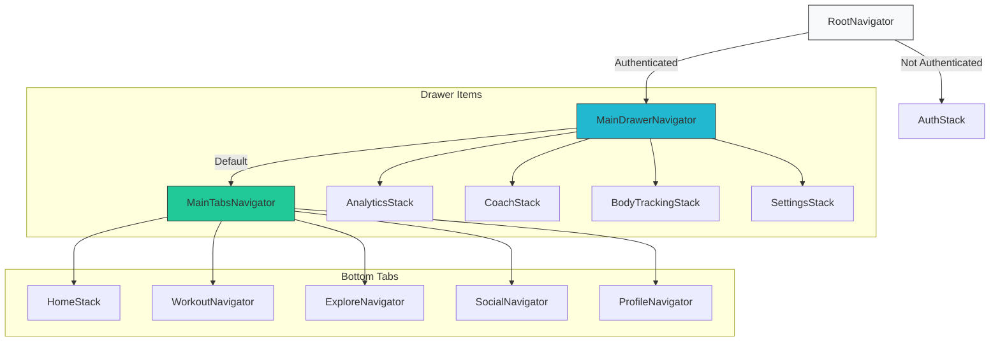
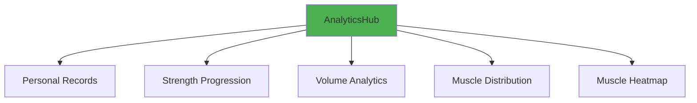
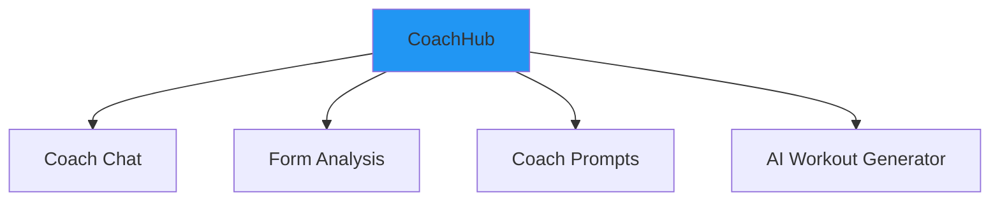
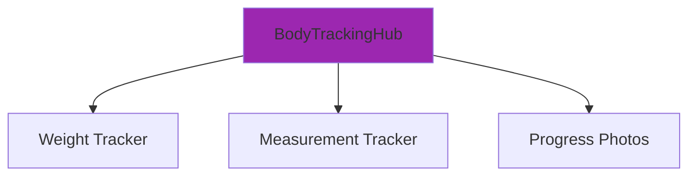
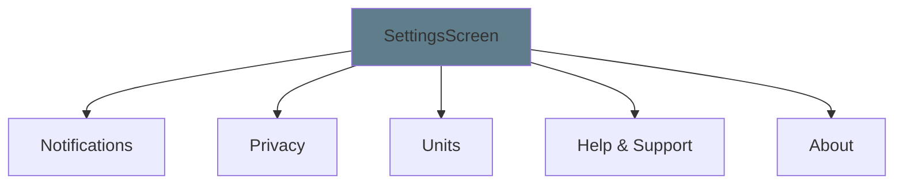

# Navigation Architecture Diagrams

## Overview
This document visualizes the implemented navigation architecture for FitAI. The system uses a "5 Tabs + Drawer" pattern to balance accessibility with feature depth.

---

## 1. High-Level Hierarchy

### Root Structure
The application uses a customized Drawer Navigator as the root for authenticated users.

---

## 2. Domain Navigators

### 📊 Analytics Navigator
**Route:** `Analytics` (via Drawer)

### 🤖 Coach Navigator
**Route:** `Coach` (via Drawer)

### 📸 Body Tracking Navigator
**Route:** `BodyTracking` (via Drawer)

### ⚙️ Settings Navigator
**Route:** `SettingsNavigator` (via Drawer)

---

## 3. Navigation Patterns

### 3.1 Hub-and-Spoke
Every domain navigator (Analytics, Coach, Body Tracking) starts with a **Hub Screen**.
- **Hub:** Dashboard with summary cards and quick actions.
- **Spokes:** Feature screens linked from the Hub.
- **Back Action:** Always returns to the Hub.

### 3.2 Drawer Access
- **Primary:** Swipe from right edge (or tap menu icon).
- **Secondary:** "Quick Links" from `ProfileHubScreen`.
  - Tapping "Analytics" card in Profile → Navigates to `Analytics` in Drawer.

### 3.3 Modal Actions
Actions that don't change the context are presented as modals:
- `CreatePostScreen`
- `LogWeightModal`
- `FilterSettings`

---

## 4. State Management
- **Navigation State:** Managed by React Navigation (persisted automatically).
- **Data State:** 
  - `Remote Data`: React Query (shared across navigators).
  - `UI State`: Local `useState` or Zustand stores (e.g., `workoutStore`).
  - `User Session`: `authStore` (global).
